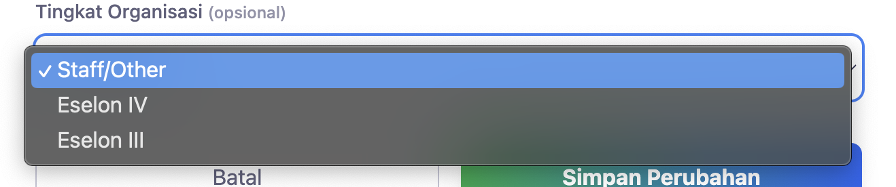

# task 1 (DONE)
the parser now can only parse eselon, I want the parser able to parse other roles such as 

1.⁠ ⁠Eselon II
2.⁠ ⁠Eselon III
3.⁠ ⁠Eselon IV

for staff, can we add the detail instead of staff/other it should looks like this
4.⁠ ⁠Staff ASN Sekretariat
5.⁠ ⁠Staff Non ASN Sekretariat
6.⁠ ⁠Staff ASN Bidang Hukum
7.⁠ ⁠Staff ASN Bidang Pemberdayaan Sosial
8.⁠ ⁠Staff Non ASN Bidang Pemberdayaan Sosial
9.⁠ ⁠Staff ASN Bidang Rehabilitasi Sosial
10.⁠ ⁠Staff Non ASN Bidang Rehabilitasi Sosial
11.⁠ ⁠Staff ASN Bidang Perlindungan dan Jaminan Sosial
12.⁠ ⁠Staff Non ASN Bidang Perlindungan dan Jaminan Sosial
13.⁠ ⁠Staff ASN Bidang Penanganan Bencana
14.⁠ ⁠Staff Non ASN Bidang Penanganan Bencana

# task 2 (DONE)
Saat ini, penilaian untuk eselon III dan IV menggunakan bobot 4,25% untuk setiap parameter kecuali kepemimpinan 8,5%. Ganti menjadi 5% untuk setiap parameter kecuali kepemimpinan 10%.

setelah setiap parameter dihitung, tidak perlu lagi dihitung 30%. biarkanlah nilai max bertotal 25,5%.

begitu juga kualitas kinerja, tidak perlu lagi dihitung 50%, biarkanlah nilai max bertotal 42,5%. dan tidak perlu lagi dihitung 20% untuk penilaian pimpinan, biarkanlah nilai max bertotal 17%.

tolong konfirmasi perhitungan, sehingga apabila Hasil Total Nilai
60,00-69,99 adalah Kurang Baik, 70,00-79,99 adalah Baik, dan >80 adalah Sangat Baik. dan nilai max adalah 85%.

untuk staff,

PENILAIAN STAFF

1.⁠ ⁠Perilaku Kerja 30%*
•⁠  ⁠Kehadiran dan Tepat Waktu 5% (2) 4,25
•⁠  ⁠Managemen waktu kerja 5% (4 ) 4,25
•⁠  ⁠Kerja sama dan teamwork 5% (3) 4,25
•⁠  ⁠Inisiatif dan Flexibilitas 5% (1) 4,25
•⁠  ⁠Kepemimpinan (loyalitas) 10% (6) 8,5
nilai max : 25,5

2. Kualitas Kinerja 70%
•⁠  ⁠Kualitas Kinerja 50% (5) 
•⁠  ⁠Kemampuan berkomunikasi 10% (7) 8,5
•⁠  ⁠Pemahaman urusan sosial 10% (8) 8,5
nilai max :

# TASK 3
implement bulk edit data pegawai, entah itu delete atau mengubah attribute lain.

# TASK 4
implement seluruh pilihan jabatan pada modal edit pegawai

# TASK 5
Saat ini aplikasi seperti kurang reaktif, ketika saya mengubah sebuah jabatan pada modal edit pegawai, maka data pegawai yang ada pada overview dashboard tidak pindah dari staff ke jabatan yang baru. 

# TASK 6
saat nama pegawai baru terdetksi (bisa jadi dia memang tidak ada data pegawainya, atau ada tapi tidak match), kita harus menghandle pegawai baru dengan memberikan modal edit data pegawai. sehingga, user bisa langsung memasukan informasi pegawai tersebut dan tidak secara otomatis dianggap sebagai staff.